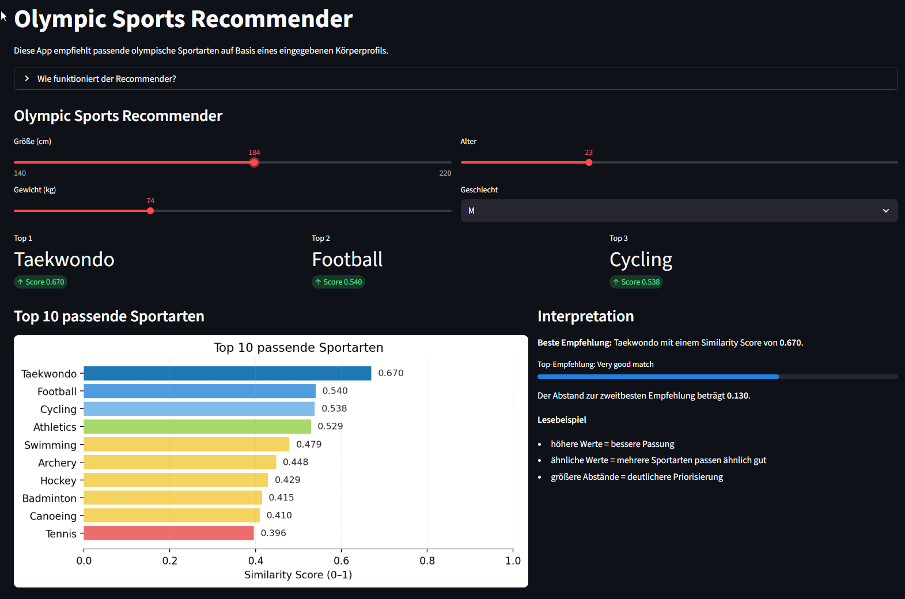
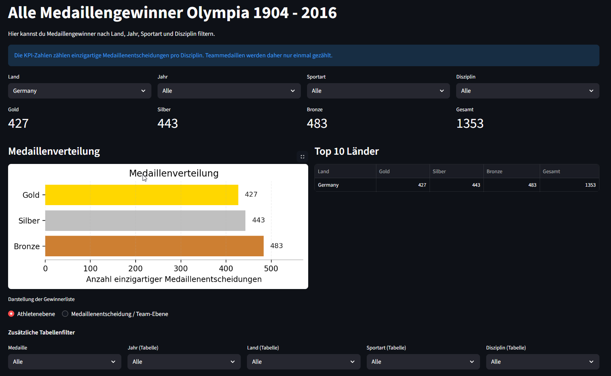

# 🏅 Olympic Sports Recommender & Analytics Dashboard

This project is an interactive data application that combines a **sports recommender system** with an **Olympic analytics dashboard**.

It allows users to:
- get personalized sport recommendations based on physical attributes  
- explore historical Olympic medal data  
- analyze performance trends across countries, sports, and years  

---

## 🚀 Live Demo
*(optional – kommt später mit Streamlit Cloud)*

---

## 🧠 Features

### 🔹 Sports Recommender
- Input: height, weight, age, gender  
- Output: top matching Olympic sports  
- Similarity-based scoring system  
- Top 10 recommendations with visualization  

### 🔹 Olympic Analytics Dashboard
- Filter by country, year, sport, discipline  
- Medal distribution (Gold / Silver / Bronze)  
- KPI overview (total medals)  
- Top countries ranking  
- Interactive charts  

---

## 🏗️ Tech Stack

- **Python** (pandas, numpy)
- **SQL / PostgreSQL (Neon)**
- **SQLAlchemy**
- **Streamlit**
- **Data Visualization** (matplotlib)

---

## 📊 Screenshots

### Sports Recommender


### Analytics Dashboard


---

## ⚙️ Setup

### 1. Clone repository
```bash
git clone https://github.com/l1ghty34r/olympic-sports-recommender.git
cd olympic-sports-recommender